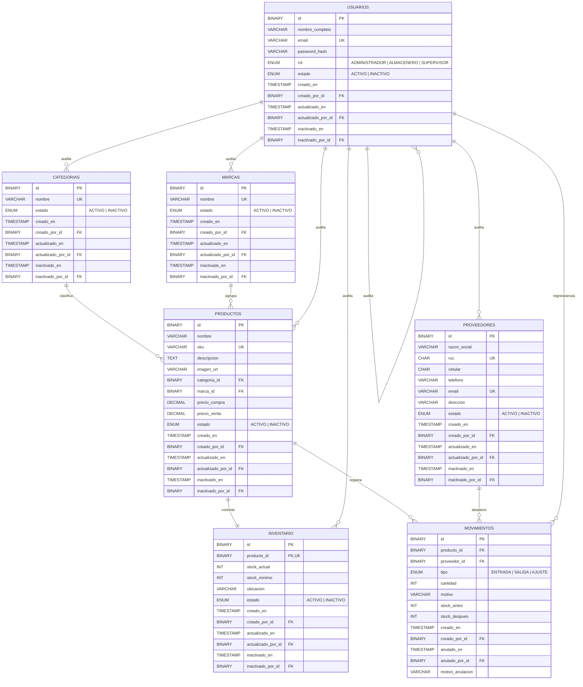
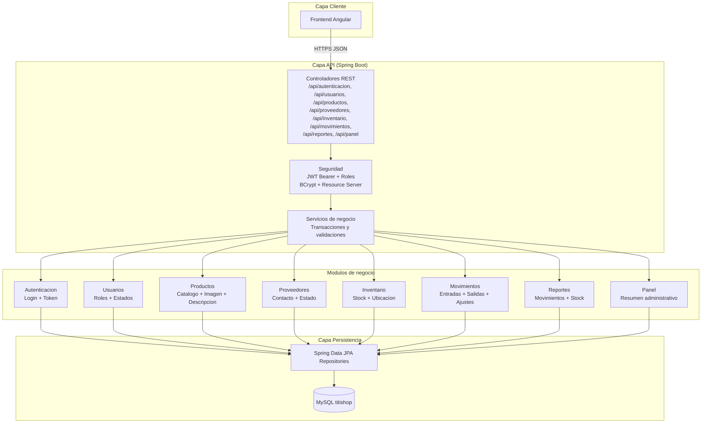

# TitiShop Backend API

## 1. Descripcion del proyecto
Backend del sistema TitiShop para gestion de productos, proveedores, inventario, movimientos y reportes operativos.

Permite preparar la base tecnica para:
- autenticacion stateless con JWT,
- gestion de usuarios con roles,
- catalogo de productos con categoria, marca, imagen y descripcion,
- control de proveedores,
- administracion de stock por producto,
- registro historico de movimientos de inventario,
- consultas para reportes y panel administrativo.

## 2. Objetivo del backend
Centralizar las operaciones del negocio con una arquitectura modular y mantenible:

`Autenticacion -> Catalogos -> Inventario -> Movimientos -> Reportes -> Panel`

El proyecto actualmente deja preparada la estructura por funcionalidades, entidades, repositorios, servicios, controladores, DTOs, seguridad JWT y documentacion inicial de base de datos.

## 3. Arquitectura y stack
| Stack | Descripcion |
|---|---|
| Java 21 | Lenguaje base del backend. |
| Spring Boot 4.0.6 | Framework principal para construir la API. |
| Spring Web MVC | Exposicion de endpoints REST. |
| Spring Data JPA | Persistencia y mapeo de entidades. |
| Spring Security | Autenticacion, autorizacion y proteccion de endpoints. |
| OAuth2 Resource Server | Validacion de JWT Bearer. |
| MySQL 8+ | Motor de base de datos relacional objetivo. |
| Flyway | Gestion esperada de migraciones de esquema. |
| Springdoc OpenAPI | Documentacion interactiva de la API. |
| JUnit 5 | Pruebas automatizadas. |

## 4. Dependencias principales
| Dependencia | Uso |
|---|---|
| `spring-boot-starter-webmvc` | Controladores REST y ciclo HTTP. |
| `spring-boot-starter-data-jpa` | Repositorios JPA y persistencia ORM. |
| `spring-boot-starter-security` | Seguridad de la aplicacion. |
| `spring-boot-starter-oauth2-resource-server` | Validacion de tokens JWT. |
| `spring-boot-starter-validation` | Validacion de DTOs con Jakarta Bean Validation. |
| `springdoc-openapi-starter-webmvc-ui` | Swagger UI y especificacion OpenAPI. |
| `mysql-connector-j` | Driver MySQL en tiempo de ejecucion. |
| `flyway-core` / `flyway-mysql` | Migraciones versionadas para MySQL. |
| `h2` | Base de datos en memoria para pruebas. |

## 5. Estructura del proyecto
```text
titishop-backend-springboot/
├── src/
│   ├── main/
│   │   ├── java/com/titishop/
│   │   │   ├── autenticacion/       # Login, JWT y configuracion de seguridad
│   │   │   ├── usuarios/            # Usuarios, roles y estados
│   │   │   ├── productos/           # Productos, categorias y marcas
│   │   │   ├── proveedores/         # Proveedores y datos de contacto
│   │   │   ├── inventario/          # Stock, stock minimo y ubicacion
│   │   │   ├── movimientos/         # Entradas, salidas y ajustes
│   │   │   ├── reportes/            # Reportes de movimientos
│   │   │   ├── panel/               # Resumen administrativo
│   │   │   ├── compartido/          # Configuracion, errores, auditoria y validaciones comunes
│   │   │   └── TitishopBackendApplication.java
│   │   └── resources/
│   │       ├── Base de datos/
│   │       │   └── creacion-base-datos.md
│   │       └── application.properties
│   └── test/
│       └── java/com/titishop/       # Pruebas de estructura, seguridad y entidades
├── pom.xml
├── mvnw
└── README.md
```

## 6. Modulos funcionales
| Modulo | Descripcion |
|---|---|
| `autenticacion` | Login por email/password y emision de JWT. |
| `usuarios` | Estructura para gestion de usuarios, roles y estados. |
| `productos` | Producto con SKU, descripcion, imagen, categoria, marca y precios. |
| `proveedores` | Datos comerciales y de contacto de proveedores. |
| `inventario` | Stock actual, stock minimo, ubicacion y estado por producto. |
| `movimientos` | Historial de entradas, salidas y ajustes con stock antes/despues. |
| `reportes` | Base para reportes sobre movimientos e inventario. |
| `panel` | Base para resumen administrativo del sistema. |
| `compartido` | Auditoria comun, respuestas de error, CORS y validaciones compartidas. |

## 7. Reglas de negocio clave
- Roles de usuario previstos: `ADMINISTRADOR`, `ALMACENERO`, `SUPERVISOR`.
- Estados de catalogo: `ACTIVO` / `INACTIVO`.
- El producto debe tener `nombre`, `sku`, `descripcion`, `imagen_url`, categoria, marca, precio de compra y precio de venta.
- Inventario mantiene un registro unico por producto.
- Movimientos son historicos:
  - tipos validos: `ENTRADA`, `SALIDA`, `AJUSTE`;
  - registran producto, proveedor opcional, cantidad, motivo, stock antes y stock despues;
  - no se editan ni se inactivan, se anulan con datos de anulacion.
- Las entidades modificables heredan auditoria comun: `creado_en`, `creado_por`, `actualizado_en`, `actualizado_por`, `inactivado_en`, `inactivado_por`.
- La logica de negocio final se debe implementar en servicios, manteniendo el flujo `controller -> service -> repository`.

## 8. API principal
Base URL actual: `/api`

| Modulo | Metodo | Endpoint | Estado |
|---|---|---|---|
| Autenticacion | `POST` | `/api/autenticacion/login` | Implementado |
| Usuarios | Pendiente | `/api/usuarios` | Estructura creada |
| Productos | Pendiente | `/api/productos` | Estructura creada |
| Proveedores | Pendiente | `/api/proveedores` | Estructura creada |
| Inventario | Pendiente | `/api/inventario` | Estructura creada |
| Movimientos | Pendiente | `/api/movimientos` | Estructura creada |
| Reportes | Pendiente | `/api/reportes` | Estructura creada |
| Panel | Pendiente | `/api/panel` | Estructura creada |

Documentacion interactiva esperada con Springdoc:
- Swagger UI: `http://localhost:8080/swagger-ui.html`
- OpenAPI JSON: `http://localhost:8080/v3/api-docs`

## 9. Seguridad
- Autenticacion con JWT Bearer.
- Sesiones deshabilitadas: politica stateless.
- CSRF deshabilitado para API REST.
- Password hashing con BCrypt.
- `JWT_SECRET` se lee desde variable de entorno.
- Rutas publicas:
  - `/api/autenticacion/**`
  - `/swagger-ui/**`
  - `/swagger-ui.html`
  - `/v3/api-docs/**`
- Rutas protegidas:
  - `/api/usuarios/**`: requiere rol `ADMINISTRADOR`.
  - `/api/reportes/**`: requiere rol `ADMINISTRADOR` o `SUPERVISOR`.
  - cualquier otra ruta requiere autenticacion.

## 10. Roles y permisos previstos
| Accion | ADMINISTRADOR | ALMACENERO | SUPERVISOR |
|---|---|---|---|
| Iniciar sesion | Si | Si | Si |
| Gestionar usuarios | Si | No | No |
| Gestionar productos | Si | Si | No |
| Gestionar proveedores | Si | Si | No |
| Gestionar inventario | Si | Si | No |
| Registrar movimientos | Si | Si | No |
| Consultar reportes | Si | No | Si |
| Consultar panel administrativo | Si | No | Si |

## 11. Configuracion por entorno
Variables principales:

```env
SPRING_DATASOURCE_URL=jdbc:mysql://localhost:3306/titishop?useSSL=false&allowPublicKeyRetrieval=true&serverTimezone=America/Lima
SPRING_DATASOURCE_USERNAME=usuario
SPRING_DATASOURCE_PASSWORD=password
JWT_SECRET=clave-segura-de-al-menos-32-bytes
```

Propiedades relevantes del proyecto:

```properties
spring.application.name=titishop-backend
spring.jpa.open-in-view=false
spring.jpa.hibernate.ddl-auto=none
spring.flyway.enabled=true
app.jwt.issuer=titishop-backend
app.jwt.expiration-minutes=120
```

## 12. Ejecucion local
```bash
./mvnw clean test
./mvnw spring-boot:run
```

La API queda disponible por defecto en:
- Aplicacion: `http://localhost:8080`
- Swagger UI: `http://localhost:8080/swagger-ui.html`

## 13. Modelo logico de base de datos (TitiShop)


## 14. Diagrama de arquitectura (TitiShop)


## 15. Relaciones especiales
### Producto - Categoria - Marca
- Un producto pertenece a una categoria.
- Un producto pertenece a una marca.
- Categoria y marca funcionan como catalogos independientes para facilitar filtros y mantenimiento.

### Producto - Inventario
- Cada producto tiene como maximo un registro de inventario.
- Inventario concentra `stock_actual`, `stock_minimo`, `ubicacion` y `estado`.

### Movimiento - Producto - Proveedor
- Cada movimiento pertenece a un producto.
- El proveedor es opcional porque una salida o ajuste puede no depender de proveedor.
- El movimiento conserva `stock_antes` y `stock_despues` para trazabilidad.

## 16. Requerimientos funcionales
| ID | Requerimiento | Descripcion |
|---|---|---|
| RF-01 | Autenticacion de usuarios | El sistema debe permitir iniciar sesion con email y password, validando `password_hash` y emitiendo JWT. |
| RF-02 | Gestion de usuarios | Permitir crear, consultar, actualizar e inactivar usuarios segun rol autorizado. |
| RF-03 | Gestion de productos | Permitir administrar productos con SKU, imagen, descripcion, categoria, marca y precios. |
| RF-04 | Gestion de categorias | Permitir administrar categorias de productos. |
| RF-05 | Gestion de marcas | Permitir administrar marcas de productos. |
| RF-06 | Gestion de proveedores | Permitir administrar proveedores con RUC, contactos, email y direccion. |
| RF-07 | Gestion de inventario | Permitir consultar y actualizar stock, stock minimo y ubicacion por producto. |
| RF-08 | Registro de movimientos | Permitir registrar entradas, salidas y ajustes de inventario. |
| RF-09 | Control de stock negativo | Bloquear operaciones que dejen `stock_actual` por debajo de cero. |
| RF-10 | Anulacion de movimientos | Permitir anular movimientos historicos conservando motivo, fecha y usuario responsable. |
| RF-11 | Reportes operativos | Exponer reportes de movimientos, stock y productos criticos. |
| RF-12 | Panel administrativo | Exponer indicadores resumidos para el dashboard del frontend. |

## 17. Requerimientos no funcionales
| ID | Requerimiento | Descripcion |
|---|---|---|
| RNF-01 | Seguridad JWT | Firmar y validar tokens con secreto configurable por entorno. |
| RNF-02 | Control de acceso | Aplicar permisos por rol en endpoints sensibles. |
| RNF-03 | Seguridad de passwords | Guardar passwords hasheadas, nunca en texto plano. |
| RNF-04 | Integridad de datos | Usar PK, FK, restricciones unicas, checks y validaciones de servicio. |
| RNF-05 | Mantenibilidad | Mantener arquitectura por funcionalidad y capas `controller`, `service`, `repository`. |
| RNF-06 | Transacciones | Ubicar limites transaccionales en la capa de servicios. |
| RNF-07 | Auditoria | Registrar creador, editor e inactivador en entidades modificables. |
| RNF-08 | Migraciones | Versionar cambios de base de datos con Flyway cuando el modelo sea aprobado. |
| RNF-09 | Documentacion API | Mantener Swagger/OpenAPI actualizado. |
| RNF-10 | Pruebas | Agregar pruebas unitarias e integracion por cada modulo implementado. |

## 18. Base de datos
- Borrador SQL en Markdown: `src/main/resources/Base de datos/creacion-base-datos.md`.
- El borrador no se ejecuta automaticamente.
- Cuando el modelo sea aprobado, debe convertirse a migraciones Flyway en `src/main/resources/db/migration`.
- Motor objetivo: MySQL 8.
- Zona horaria recomendada para configuracion de conexion: `America/Lima`.

## 19. Estado actual
- Rama de trabajo: `dev`.
- Estructura modular creada.
- Entidades principales creadas.
- Repositorios base creados.
- Servicios y controladores base creados.
- Seguridad JWT agregada.
- Endpoint de login implementado.
- Pruebas de estructura, entidades y seguridad ejecutadas correctamente.
- Pendiente: implementar logica CRUD, reglas de inventario, reportes reales y migraciones Flyway ejecutables.
