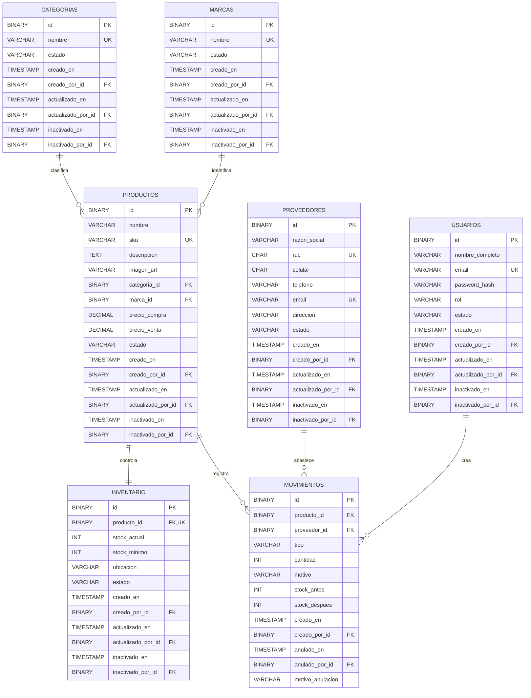

# TitiShop Backend API

## 1. Descripción del proyecto
Backend del sistema TitiShop para gestión operativa de inventario, productos, proveedores, usuarios, movimientos, reportes y panel administrativo.

Permite:
- autenticación stateless con JWT Bearer,
- autorización por roles de usuario,
- gestión de productos, categorías y marcas,
- gestión de proveedores con consulta externa de RUC,
- carga y publicación de imágenes de productos,
- control de stock por producto,
- registro y anulación de movimientos de inventario,
- consultas de reportes operativos,
- resumen administrativo para dashboard,
- migraciones versionadas de base de datos con Flyway.

## 2. Objetivo del backend
Centralizar las operaciones del negocio con una arquitectura modular y reglas de negocio consistentes:

`Autenticación -> Catálogos -> Proveedores -> Inventario -> Movimientos -> Reportes -> Panel`

La aplicación expone una API REST bajo `/api`, mantiene la lógica de negocio en servicios, valida las entradas con DTOs y Jakarta Bean Validation, y persiste los datos en MySQL mediante Spring Data JPA.

## 3. Arquitectura y stack
| Stack | Descripción |
|---|---|
| Java 21 | Lenguaje base del backend. |
| Spring Boot 4.0.6 | Framework principal de la aplicación. |
| Spring Web MVC | Exposición de endpoints REST. |
| Spring Data JPA | Persistencia ORM y repositorios. |
| Spring Security | Autenticación, autorización y protección de rutas. |
| OAuth2 Resource Server | Validación de tokens JWT Bearer. |
| BCrypt | Hash de contraseñas de usuarios. |
| MySQL 8+ | Base de datos relacional objetivo. |
| Flyway | Migraciones versionadas de esquema y datos semilla. |
| Springdoc OpenAPI | Documentación interactiva de API. |
| H2 | Base de datos en memoria para pruebas. |
| JUnit 5 | Pruebas automatizadas. |

## 4. Dependencias principales
| Dependencia | Uso |
|---|---|
| `spring-boot-starter-webmvc` | Controladores REST y ciclo HTTP. |
| `spring-boot-starter-data-jpa` | Entidades, repositorios y persistencia. |
| `spring-boot-starter-security` | Seguridad HTTP y reglas de acceso. |
| `spring-boot-starter-oauth2-resource-server` | Validación de JWT en requests protegidos. |
| `spring-boot-starter-validation` | Validación de DTOs con anotaciones Jakarta. |
| `springdoc-openapi-starter-webmvc-ui` | Swagger UI y OpenAPI JSON. |
| `mysql-connector-j` | Driver MySQL en tiempo de ejecución. |
| `flyway-core` / `flyway-mysql` | Migraciones para MySQL. |
| `jackson-datatype-jsr310` | Serialización de fechas Java Time. |
| `spring-boot-starter-test` | Base de pruebas unitarias e integración. |
| `spring-boot-starter-security-test` | Utilidades de pruebas de seguridad. |
| `spring-boot-starter-webmvc-test` | Pruebas de controladores MVC. |
| `h2` | Base de datos para pruebas automatizadas. |

## 5. Estructura del proyecto
```text
titishop-backend-springboot/
├── src/
│   ├── main/
│   │   ├── java/com/titishop/
│   │   │   ├── archivos/           # Carga y publicación de archivos de productos
│   │   │   ├── autenticacion/      # Login, JWT y configuración de seguridad
│   │   │   ├── compartido/         # Configuración, errores, auditoría y utilidades comunes
│   │   │   ├── inventario/         # Stock, stock mínimo, ubicación y estado
│   │   │   ├── movimientos/        # Entradas, salidas, ajustes y anulaciones
│   │   │   ├── panel/              # Resumen administrativo
│   │   │   ├── productos/          # Productos, categorías y marcas
│   │   │   ├── proveedores/        # Proveedores y consulta RUC externa
│   │   │   ├── reportes/           # Reportes de movimientos, stock y valorización
│   │   │   ├── usuarios/           # Usuarios, roles y estados
│   │   │   └── TitishopBackendApplication.java
│   │   └── resources/
│   │       ├── Base de datos/
│   │       │   └── creacion-base-datos.md
│   │       ├── db/migration/
│   │       │   ├── V1__crear_esquema_titishop.sql
│   │       │   ├── V2__sembrar_usuario_administrador.sql
│   │       │   ├── V3__actualizar_usuario_administrador_kevin.sql
│   │       │   ├── V4__permitir_contacto_opcional_proveedores.sql
│   │       │   └── V5__sembrar_catalogo_inventario_movimientos.sql
│   │       └── application.properties
│   └── test/
│       ├── java/com/titishop/       # Pruebas unitarias, seguridad e integración
│       └── resources/
│           └── application.properties
├── Dockerfile
├── pom.xml
├── mvnw
└── README.md
```

## 6. Módulos funcionales
| Módulo | Descripción |
|---|---|
| `autenticacion` | Login por email/password, emisión de JWT y datos de sesión. |
| `usuarios` | CRUD de usuarios, roles `ADMINISTRADOR`, `ALMACENERO`, `SUPERVISOR` y estados. |
| `productos` | CRUD de productos con SKU, descripción, imagen, categoría, marca y precios. |
| `productos/categorias` | Catálogo de categorías activas/inactivas. |
| `productos/marcas` | Catálogo de marcas activas/inactivas. |
| `proveedores` | CRUD de proveedores, validación de RUC/email y consulta externa por RUC. |
| `inventario` | Registro único de inventario por producto, stock actual, stock mínimo y ubicación. |
| `movimientos` | Registro histórico de entradas, salidas, ajustes y anulación de movimientos. |
| `reportes` | Consultas de movimientos, stock, stock crítico y valorización. |
| `panel` | Indicadores administrativos para dashboard. |
| `archivos` | Carga de imágenes de productos en formato multipart. |
| `compartido` | Auditoría, CORS, OpenAPI, Flyway, errores globales y validaciones comunes. |

## 7. Reglas de negocio clave
- Roles permitidos: `ADMINISTRADOR`, `ALMACENERO`, `SUPERVISOR`.
- Estados de catálogo y usuarios: `ACTIVO` / `INACTIVO`.
- La autenticación usa JWT Bearer y sesiones stateless.
- El secreto JWT debe tener al menos 32 bytes.
- Los productos tienen SKU único y deben pertenecer a una categoría y una marca.
- El precio de venta no puede ser menor que el precio de compra.
- El inventario mantiene un registro único por producto.
- El stock actual y el stock mínimo no pueden ser negativos.
- Los movimientos soportan tipos `ENTRADA`, `SALIDA` y `AJUSTE`.
- Los movimientos guardan stock antes y stock después para trazabilidad.
- Las salidas no pueden dejar stock negativo.
- Las entradas pueden asociarse a un proveedor.
- Los movimientos históricos no se eliminan; se anulan registrando usuario, fecha y motivo.
- Las entidades administrables heredan auditoría común: creación, actualización e inactivación.
- La lógica de negocio se mantiene en servicios siguiendo el flujo `controller -> service -> repository`.

## 8. API principal
Base URL local: `http://localhost:8080/api`

Base URL producción: `https://api-titishop.proyectoutp.com/api`

| Módulo | Método | Endpoint | Acceso |
|---|---|---|---|
| Autenticación | `POST` | `/api/autenticacion/login` | Público |
| Usuarios | `GET` | `/api/usuarios` | ADMINISTRADOR |
| Usuarios | `GET` | `/api/usuarios/{id}` | ADMINISTRADOR |
| Usuarios | `POST` | `/api/usuarios` | ADMINISTRADOR |
| Usuarios | `PUT` | `/api/usuarios/{id}` | ADMINISTRADOR |
| Usuarios | `DELETE` | `/api/usuarios/{id}` | ADMINISTRADOR |
| Categorías | `GET` | `/api/categorias` | ADMINISTRADOR / ALMACENERO |
| Categorías | `GET` | `/api/categorias/{id}` | ADMINISTRADOR / ALMACENERO |
| Categorías | `POST` | `/api/categorias` | ADMINISTRADOR / ALMACENERO |
| Categorías | `PUT` | `/api/categorias/{id}` | ADMINISTRADOR / ALMACENERO |
| Categorías | `DELETE` | `/api/categorias/{id}` | ADMINISTRADOR / ALMACENERO |
| Marcas | `GET` | `/api/marcas` | ADMINISTRADOR / ALMACENERO |
| Marcas | `GET` | `/api/marcas/{id}` | ADMINISTRADOR / ALMACENERO |
| Marcas | `POST` | `/api/marcas` | ADMINISTRADOR / ALMACENERO |
| Marcas | `PUT` | `/api/marcas/{id}` | ADMINISTRADOR / ALMACENERO |
| Marcas | `DELETE` | `/api/marcas/{id}` | ADMINISTRADOR / ALMACENERO |
| Productos | `GET` | `/api/productos` | ADMINISTRADOR / ALMACENERO |
| Productos | `GET` | `/api/productos/{id}` | ADMINISTRADOR / ALMACENERO |
| Productos | `POST` | `/api/productos` | ADMINISTRADOR / ALMACENERO |
| Productos | `PUT` | `/api/productos/{id}` | ADMINISTRADOR / ALMACENERO |
| Productos | `DELETE` | `/api/productos/{id}` | ADMINISTRADOR / ALMACENERO |
| Proveedores | `GET` | `/api/proveedores` | ADMINISTRADOR / ALMACENERO |
| Proveedores | `GET` | `/api/proveedores/{id}` | ADMINISTRADOR / ALMACENERO |
| Proveedores | `GET` | `/api/proveedores/consulta-ruc/{ruc}` | Público |
| Proveedores | `POST` | `/api/proveedores` | ADMINISTRADOR / ALMACENERO |
| Proveedores | `PUT` | `/api/proveedores/{id}` | ADMINISTRADOR / ALMACENERO |
| Proveedores | `DELETE` | `/api/proveedores/{id}` | ADMINISTRADOR / ALMACENERO |
| Inventario | `GET` | `/api/inventario` | ADMINISTRADOR / ALMACENERO |
| Inventario | `GET` | `/api/inventario/{id}` | ADMINISTRADOR / ALMACENERO |
| Inventario | `POST` | `/api/inventario` | ADMINISTRADOR / ALMACENERO |
| Inventario | `PUT` | `/api/inventario/{id}` | ADMINISTRADOR / ALMACENERO |
| Inventario | `DELETE` | `/api/inventario/{id}` | ADMINISTRADOR / ALMACENERO |
| Movimientos | `GET` | `/api/movimientos` | ADMINISTRADOR / ALMACENERO |
| Movimientos | `GET` | `/api/movimientos/{id}` | ADMINISTRADOR / ALMACENERO |
| Movimientos | `POST` | `/api/movimientos` | ADMINISTRADOR / ALMACENERO |
| Movimientos | `POST` | `/api/movimientos/{id}/anulacion` | ADMINISTRADOR / ALMACENERO |
| Reportes | `GET` | `/api/reportes/movimientos` | ADMINISTRADOR / SUPERVISOR |
| Reportes | `GET` | `/api/reportes/stock` | ADMINISTRADOR / SUPERVISOR |
| Reportes | `GET` | `/api/reportes/stock-critico` | ADMINISTRADOR / SUPERVISOR |
| Reportes | `GET` | `/api/reportes/valorizacion` | ADMINISTRADOR / SUPERVISOR |
| Panel | `GET` | `/api/panel/resumen` | ADMINISTRADOR / SUPERVISOR |
| Archivos | `POST` | `/api/archivos/productos` | ADMINISTRADOR / ALMACENERO |
| Swagger | `GET` | `/swagger` | Público |
| OpenAPI | `GET` | `/v3/api-docs` | Público cuando Springdoc está habilitado |

Documentación interactiva:
- Swagger UI local: `http://localhost:8080/swagger`
- Swagger UI producción: `https://api-titishop.proyectoutp.com/swagger`
- OpenAPI JSON: `http://localhost:8080/v3/api-docs`

## 9. Seguridad
- Autenticación con JWT Bearer.
- Política de sesión `STATELESS`.
- CSRF deshabilitado para API REST.
- Password hashing con `BCryptPasswordEncoder`.
- CORS configurable por variable `CORS_ALLOWED_ORIGINS`.
- Validación de autoridades desde el claim JWT `authorities`.
- Rutas públicas:
  - `/api/autenticacion/**`
  - `/api/proveedores/consulta-ruc/**`
  - `/uploads/**`
  - `/swagger`
  - `/swagger/**`
  - `/swagger-ui/**`
  - `/swagger-ui.html`
  - `/v3/api-docs/**`
- Rutas protegidas:
  - `/api/usuarios/**`: requiere `ADMINISTRADOR`.
  - `/api/categorias/**`, `/api/marcas/**`, `/api/productos/**`, `/api/proveedores/**`, `/api/inventario/**`, `/api/movimientos/**`, `/api/archivos/**`: requieren `ADMINISTRADOR` o `ALMACENERO`.
  - `/api/reportes/**`, `/api/panel/**`: requieren `ADMINISTRADOR` o `SUPERVISOR`.
  - cualquier otra ruta requiere autenticación.

## 10. Roles y permisos
| Acción | ADMINISTRADOR | ALMACENERO | SUPERVISOR |
|---|---|---|---|
| Iniciar sesión | Sí | Sí | Sí |
| Gestionar usuarios | Sí | No | No |
| Gestionar categorías y marcas | Sí | Sí | No |
| Gestionar productos | Sí | Sí | No |
| Gestionar proveedores | Sí | Sí | No |
| Consultar RUC de proveedor | Sí | Sí | Sí |
| Gestionar inventario | Sí | Sí | No |
| Registrar movimientos | Sí | Sí | No |
| Anular movimientos | Sí | Sí | No |
| Cargar imágenes de productos | Sí | Sí | No |
| Consultar reportes | Sí | No | Sí |
| Consultar panel administrativo | Sí | No | Sí |

## 11. Configuración por entorno
Variables principales:

```env
SPRING_DATASOURCE_URL=jdbc:mysql://DB_HOST:3306/titishop?useSSL=false&allowPublicKeyRetrieval=true&serverTimezone=America/Lima
SPRING_DATASOURCE_USERNAME=usuario
SPRING_DATASOURCE_PASSWORD=password
JWT_SECRET=clave-segura-de-al-menos-32-bytes
FRONTEND_PUBLIC_URL=https://titishop.proyectoutp.com
APP_PUBLIC_URL=https://api-titishop.proyectoutp.com
CORS_ALLOWED_ORIGINS=https://titishop.proyectoutp.com,https://www.titishop.proyectoutp.com
APP_UPLOAD_DIR=uploads
APP_UPLOAD_PUBLIC_URL=https://api-titishop.proyectoutp.com/uploads
APP_UPLOAD_MAX_FILE_SIZE=5MB
APP_UPLOAD_MAX_REQUEST_SIZE=6MB
FACTILIZA_API_TOKEN=token-factiliza
FACTILIZA_API_BASE_URL=https://api.factiliza.com/v1
FACTILIZA_CONNECT_TIMEOUT=3s
FACTILIZA_READ_TIMEOUT=6s
SPRINGDOC_API_DOCS_ENABLED=true
SPRINGDOC_SWAGGER_UI_ENABLED=true
```

Propiedades relevantes:

```properties
spring.application.name=titishop-backend
spring.jpa.open-in-view=false
spring.jpa.hibernate.ddl-auto=none
spring.flyway.enabled=true
app.jwt.issuer=titishop-backend
app.jwt.expiration-minutes=120
springdoc.swagger-ui.path=/swagger-ui.html
```

## 12. Ejecución local
Requisitos:
- Java 21
- Maven Wrapper incluido en el repositorio
- MySQL 8+
- Variables de entorno o archivo `.env` compatible con `application.properties`

Comandos:

```bash
./mvnw clean test
./mvnw spring-boot:run
```

Aplicación local:
- API: `http://localhost:8080/api`
- Swagger: `http://localhost:8080/swagger`
- Archivos públicos: `http://localhost:8080/uploads`

## 13. Ejecución con Docker
```bash
docker build -t titishop-backend .
docker run --rm -p 8080:8080 --env-file .env titishop-backend
```

En producción la API debe publicarse detrás de Nginx/Cloudflare en:
- Aplicación: `https://api-titishop.proyectoutp.com`
- Swagger UI: `https://api-titishop.proyectoutp.com/swagger`
- Archivos públicos: `https://api-titishop.proyectoutp.com/uploads`

## 14. Migraciones y datos semilla
Flyway ejecuta las migraciones ubicadas en `src/main/resources/db/migration/`.

| Migración | Propósito |
|---|---|
| `V1__crear_esquema_titishop.sql` | Crea tablas principales, restricciones, índices y relaciones. |
| `V2__sembrar_usuario_administrador.sql` | Inserta el usuario administrador inicial. |
| `V3__actualizar_usuario_administrador_kevin.sql` | Actualiza credenciales/datos del administrador semilla. |
| `V4__permitir_contacto_opcional_proveedores.sql` | Ajusta campos de contacto de proveedores. |
| `V5__sembrar_catalogo_inventario_movimientos.sql` | Inserta datos base para catálogos, inventario y movimientos. |

Usuario administrador semilla:

```text
email: kevin@gmail.com
password: kevin123
rol: ADMINISTRADOR
```

## 15. Modelo lógico de base de datos


## 16. Integraciones externas y archivos
### Factiliza
El módulo `proveedores` puede consultar datos de una empresa por RUC mediante Factiliza.

Configuración:
- `FACTILIZA_API_TOKEN`
- `FACTILIZA_API_BASE_URL`
- `FACTILIZA_CONNECT_TIMEOUT`
- `FACTILIZA_READ_TIMEOUT`

Endpoint relacionado:
- `GET /api/proveedores/consulta-ruc/{ruc}`

### Carga de imágenes
El módulo `archivos` recibe imágenes de productos con `multipart/form-data`, las almacena en `APP_UPLOAD_DIR` y retorna una URL pública basada en `APP_UPLOAD_PUBLIC_URL`.

Endpoint relacionado:
- `POST /api/archivos/productos`

## 17. Pruebas automatizadas
Ejecutar todas las pruebas:

```bash
./mvnw test
```

Pruebas relevantes incluidas:
- seguridad de autenticación y roles,
- controladores MVC,
- servicios de archivos,
- flujo de inventario,
- servicio de proveedores,
- Swagger controller.

## 18. Gestión del proyecto
El seguimiento de tareas, backlog y tablero del proyecto se realiza en Jira:

- [Tablero Jira TitiShop](https://utp-desarrollo.atlassian.net/jira/software/projects/DV/boards/1/backlog)

## 19. Alcance del README
Este README documenta el backend de TitiShop.

No incluye:
- documentación visual del frontend Angular,
- manual de usuario final,
- credenciales reales de producción,
- secretos de servicios externos.
